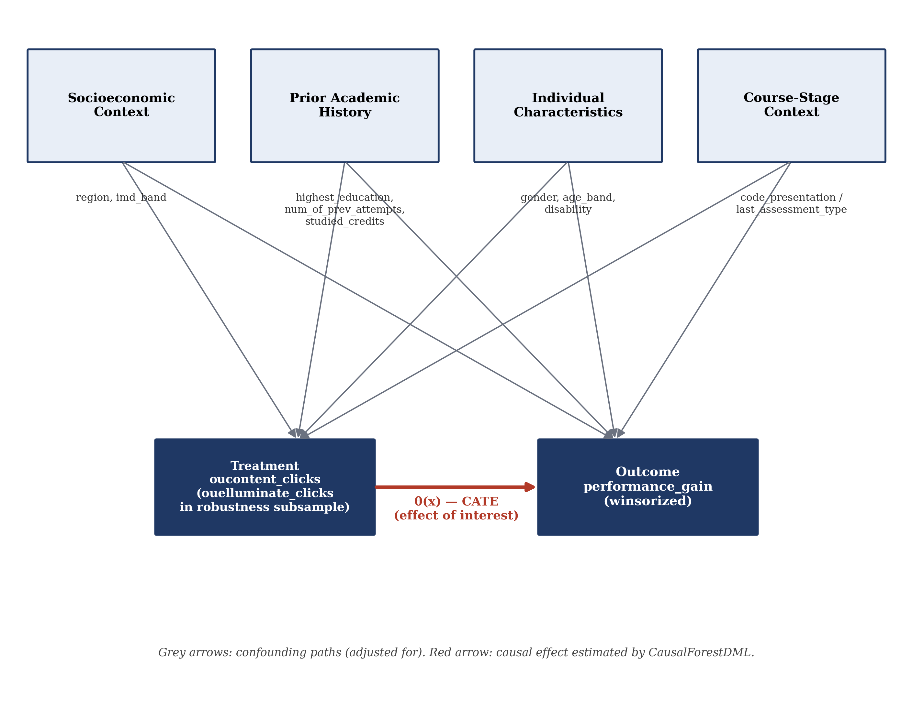

# Role 3 Memo: Causal Structure Specification

**Purpose:** Documents the directed acyclic graph (DAG) governing the OULAD causal analysis — which variables are adjusted for, why each one qualifies as a confounder rather than a mediator or collider, and what the resulting identification assumption is. This is the artifact Role 4 should cite when specifying the confounder set in `CausalForestDML`/`LinearDML`, and what the manuscript's Methods section should draw its DAG figure and adjustment-set justification from.

---

## 1. The DAG

**Structure:** four confounder blocks, each with a plausible causal path to both the treatment (`oucontent_clicks`, or `ouelluminate_clicks` in the robustness subsample) and the outcome (`performance_gain`). The red arrow — treatment → outcome — is the effect CausalForestDML estimates; the grey arrows are the confounding paths that must be blocked by conditioning for that estimate to be causally interpretable.

---

## 2. Variable-by-Variable Justification

Each variable is included because it plausibly causes *both* treatment and outcome (a genuine confounder), not because it merely predicts one or the other. Variables that only predict outcome (not treatment) would still be safe and useful to include as precision covariates; none of the variables below fall into that category exclusively — all have a defensible path to engagement behavior as well as to performance.

| Variable | Block | Path to Treatment (`oucontent_clicks`) | Path to Outcome (`performance_gain`) |
|---|---|---|---|
| `region` | Socioeconomic Context | Regional infrastructure/connectivity differences plausibly affect how much a student engages with online content | Documented regional variation in UK educational attainment |
| `imd_band` | Socioeconomic Context | Deprivation is linked to device/internet access, affecting capacity to engage with VLE content | Well-established SES–attainment relationship in the education literature |
| `highest_education` | Prior Academic History | Students entering with higher prior qualifications may navigate/use VLE resources differently | Prior qualification is a standard, strong predictor of subsequent assessment performance |
| `num_of_prev_attempts` | Prior Academic History | A student retaking a module may already be familiar with its content, changing engagement patterns (higher or lower, plausibly either direction) | Prior attempts is a strong predictor of eventual outcome, independent of current-presentation engagement |
| `studied_credits` | Prior Academic History | Total credit load affects available study time, plausibly affecting how much a student engages with any one module's content | Credit load/workload is a documented predictor of per-module performance |
| `gender` | Individual Characteristics | Documented gender differences in study/technology-use patterns | Documented (module-dependent) gender gaps in attainment |
| `age_band` | Individual Characteristics | Older/younger (mature vs. traditional-age) students engage differently with digital learning platforms | Age is a documented predictor of distance-learning outcomes |
| `disability` | Individual Characteristics | Accessibility needs plausibly affect engagement with specific content formats | Documented attainment gaps associated with disability status in OULAD literature |
| `code_presentation` / `last_assessment_type` | Course-Stage Context | Different module-presentations offer different volumes/types of `oucontent` material, affecting available engagement opportunity | **Directly informed by Role 1's finding**: `performance_gain`'s negative mean reflects course-stage difficulty escalation, which varies by presentation and by which assessment type ends up "last" — this is a required control, not an optional one |
| `code_module` | Course Identity | Different modules (courses) offer substantially different volumes of `oucontent` material and different overall engagement opportunity | Different modules have documented, substantial differences in outcome-generating processes (grading norms, subject difficulty) — confirmed empirically via leave-one-module-out CV, which showed genuine per-module ATE variation before this variable was added as a control |

**Correction note (added after Role 4 estimation):** `code_module` was omitted from the original confounder set above — an oversight, since `code_presentation` (term/year within a module) was included but the module identity itself was not, despite the same reasoning applying at one level up. This was only caught during Role 4/5 work, when a SHAP-driven investigation into gender heterogeneity revealed severe gender imbalance by module (BBB 88.7% female, FFF 82.0% male) alongside module-level ATE variation from LOGO-CV — together implying `code_module` was a real, uncontrolled confounder. Refitting with it included changed the headline ATE by 85% (0.0026 → 0.0048) and resolved an unexplained negative LOGO-CV result for module FFF. See Role 4 memo, Section 0, for the full discovery narrative. **The adjustment set in Section 5 below is the corrected, current version.**

**All nine variables are measured prior to or at the start of the presentation being analyzed** (registration-time demographics, prior-attempt history, and presentation identity) — none are affected by the treatment itself, so none are mediators. No collider (a variable caused by both treatment and outcome) was identified in this variable set.

---

## 3. Identification Assumption (for Methods section)

The causal estimate is interpretable as the effect of `oucontent`/`ouelluminate` engagement on `performance_gain` **under conditional ignorability**: that, conditional on the nine variables above, treatment assignment (engagement level) is as-good-as-random with respect to the outcome. This is the standard, necessary, and *not directly testable* assumption underlying every DML-family estimator in this study — it should be stated as an assumption in Methods, not implied silently.

**What this DAG does not and cannot rule out:** unmeasured confounders not captured in OULAD's demographic/registration fields — most importantly, student motivation, effort, and home/family academic support, none of which OULAD records directly. This should be named explicitly as a limitation in Discussion, not left for a reviewer to raise unprompted. The four DoWhy refutation tests (Role 4/5) partially probe robustness to this concern but do not eliminate it — refutation tests can increase confidence in a result's stability, but they cannot substitute for a variable that was never measured.

---

## 4. One Documented Caveat for the Robustness Subsample

`code_presentation` has only 3 levels in the `ouelluminate_clicks` robustness subsample (BBB-2013B, DDD-2013B, FFF-2013B), versus 22 in the primary corpus. Its ability to function as a meaningful control for course-stage effects is correspondingly weaker there — worth noting explicitly if Role 4/5 finds the robustness-subsample results behave differently from the primary corpus, rather than treating it as an unexplained discrepancy.

---

## 5. Handoff to Role 4

**Final adjustment set (both corpora):** `region`, `imd_band`, `highest_education`, `num_of_prev_attempts`, `studied_credits`, `gender`, `age_band`, `disability`, `code_presentation`, `code_module`.

This is the complete `X` (confounder) matrix for both `LinearDML` and `CausalForestDML` calls — no variable should be added or dropped from this set without updating this memo and re-justifying the change against Section 2's logic.
